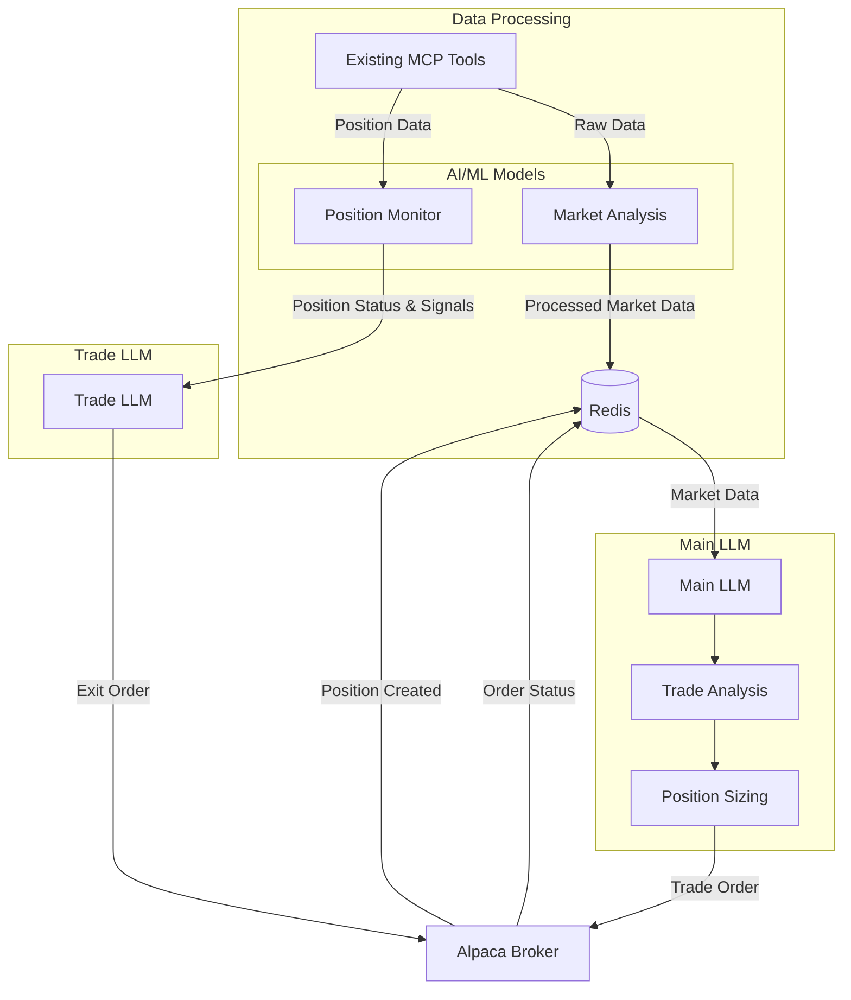

# NextG3N Trade LLM Implementation Plan

## Overview

This implementation plan outlines how to enhance the existing NextG3N system to support the Trade LLM architecture defined in `NextG3N_Trade_LLM_Architecture.md`. The plan focuses on leveraging existing MCP tools rather than creating new components, while ensuring we're not duplicating data sources or processes.

## Architecture Review



## Existing MCP Tools Analysis

We have several MCP tools that already provide the functionality we need:

1. **Data Sources**:
   - `polygon_rest_server.py` - Historical market data with ML-based pattern analysis
   - `polygon_websocket_server.py` - Real-time market data with ML-based screening
   - `alpaca_server.py` - Trading execution and position management
   - `yahoo_finance_server.py` - News and fundamental data
   - `reddit_processor_server.py` - Social sentiment analysis
   - `unusual_whales_server.py` - Options flow analysis

2. **ML Models**:
   - `polygon_websocket_server.py` already has:
     - DeepAR model for price prediction
     - TCN model for anomaly detection
     - Informer model for order book analysis
   - `polygon_rest_server.py` has:
     - PatternClassifier for technical pattern recognition

3. **Communication**:
   - `redis_server.py` - Data storage and pub/sub communication
   - `llm_talk.py` - Inter-LLM communication

## Implementation Plan

### 1. Enhance Existing MCP Tools

#### 1.1 Enhance polygon_websocket_server.py

Add GPU acceleration to the existing ML models and enhance position monitoring:

```python
# In polygon_websocket_server.py

# Update model initialization to use GPU
def _load_models(self):
    try:
        # Move models to GPU if available
        device = torch.device('cuda' if torch.cuda.is_available() else 'cpu')
        logger.info(f"Using device: {device}")
        
        # DeepAR model
        self.models["deepar"] = DeepARModel(input_dim=10, hidden_dim=64)
        model_path = os.path.join(self.model_dir, "deepar_stocks.pth")
        if os.path.exists(model_path):
            self.models["deepar"].load_state_dict(torch.load(model_path, map_location=device))
            logger.info(f"Loaded DeepAR model from {model_path}")
        self.models["deepar"].to(device)
        self.models["deepar"].eval()
        
        # TCN model
        self.models["tcn"] = TCNModel(input_dim=10, num_channels=[32, 64, 64, 32])
        model_path = os.path.join(self.model_dir, "tcn_anomaly.pth")
        if os.path.exists(model_path):
            self.models["tcn"].load_state_dict(torch.load(model_path, map_location=device))
            logger.info(f"Loaded TCN model from {model_path}")
        self.models["tcn"].to(device)
        self.models["tcn"].eval()
        
        # Informer model
        self.models["informer"] = InformerModel(enc_in=10, d_model=64)
        model_path = os.path.join(self.model_dir, "informer_orderbook.pth")
        if os.path.exists(model_path):
            self.models["informer"].load_state_dict(torch.load(model_path, map_location=device))
            logger.info(f"Loaded Informer model from {model_path}")
        self.models["informer"].to(device)
        self.models["informer"].eval()
        
        # Add XGBoost model for exit optimization
        self.models["xgboost_exit"] = self._load_xgboost_model()
        
        logger.info("All models loaded successfully")
    except Exception as e:
        logger.error(f"Error loading models: {str(e)}")

def _load_xgboost_model(self):
    """Load pre-trained XGBoost model for exit optimization"""
    try:
        import xgboost as xgb
        model_path = os.path.join(self.model_dir, "xgboost_exit_optimizer.json")
        if os.path.exists(model_path):
            model = xgb.Booster()
            model.load_model(model_path)
            logger.info(f"Loaded XGBoost exit optimizer from {model_path}")
            return model
        else:
            logger.warning(f"XGBoost model not found at {model_path}, using default parameters")
            return None
    except Exception as e:
        logger.error(f"Error loading XGBoost model: {str(e)}")
        return None
```

#### 1.2 Add Position Monitoring Endpoint

Add a new endpoint to polygon_websocket_server.py for position monitoring:

```python
@app.post("/monitor_position", tags=["Position Monitoring"])
async def api_monitor_position(symbol: str, entry_price: float, stop_loss: float, position_size: int, direction: str):
    """Monitor a position and send signals directly to Trade LLM"""
    try:
        # Get real-time data for the symbol
        buffer = []
        await polygon_ws_stream([symbol], ["T", "Q"], 60, buffer)
        
        if not buffer:
            return {
                "success": False,
                "message": "No data received for position monitoring"
            }
        
        # Process the data
        processed_data = stock_screener.preprocess_data(buffer)
        if symbol not in processed_data:
            return {
                "success": False,
                "message": f"Could not process data for {symbol}"
            }
        
        symbol_data = processed_data[symbol]
        current_price = symbol_data["close"]
        
        # Calculate metrics
        price_change = current_price - entry_price
        price_change_pct = price_change / entry_price if entry_price > 0 else 0
        
        # Apply ML models for exit signal
        features = stock_screener._extract_features(symbol_data, {"prev_close": entry_price, "prev_volume": 0})
        
        # Get predictions from models
        deepar_pred = stock_screener._predict_deepar(features)
        tcn_pred = stock_screener._predict_tcn(features)
        informer_pred = stock_screener._predict_informer(features)
        
        # Use XGBoost for exit decision if available
        exit_signal = False
        exit_reason = ""
        
        if stock_screener.models.get("xgboost_exit"):
            import xgboost as xgb
            import numpy as np
            
            # Prepare features for XGBoost
            xgb_features = [
                current_price, 
                entry_price,
                stop_loss,
                price_change_pct,
                symbol_data.get("volatility", 0),
                symbol_data.get("volume", 0),
                deepar_pred,
                tcn_pred,
                informer_pred
            ]
            
            # Convert to DMatrix
            dmatrix = xgb.DMatrix(np.array([xgb_features]))
            exit_prob = stock_screener.models["xgboost_exit"].predict(dmatrix)[0]
            
            # Decision based on probability
            if exit_prob > 0.7:  # Threshold for exit
                exit_signal = True
                exit_reason = "ML model exit signal"
        
        # Basic stop loss check
        if (direction == "long" and current_price <= stop_loss) or \
           (direction == "short" and current_price >= stop_loss):
            exit_signal = True
            exit_reason = "Stop loss triggered"
        
        # If exit signal, notify Trade LLM directly
        if exit_signal:
            # Send signal to Trade LLM
            await notify_trade_llm(symbol, current_price, exit_reason)
            
            return {
                "success": True,
                "exit_signal": True,
                "current_price": current_price,
                "reason": exit_reason
            }
        
        return {
            "success": True,
            "exit_signal": False,
            "current_price": current_price,
            "metrics": {
                "price_change": price_change,
                "price_change_pct": price_change_pct,
                "deepar_pred": deepar_pred,
                "tcn_pred": tcn_pred,
                "informer_pred": informer_pred
            }
        }
    except Exception as e:
        logger.error(f"Error monitoring position: {str(e)}")
        return {
            "success": False,
            "error": str(e)
        }

async def notify_trade_llm(symbol, price, reason):
    """Send exit signal directly to Trade LLM"""
    try:
        async with aiohttp.ClientSession() as session:
            url = "http://localhost:8009/receive_exit_signal"  # Trade LLM endpoint
            payload = {
                "symbol": symbol,
                "current_price": price,
                "exit_reason": reason,
                "timestamp": datetime.now().isoformat()
            }
            
            async with session.post(url, json=payload) as response:
                if response.status != 200:
                    logger.error(f"Failed to notify Trade LLM: {response.status}")
                    return False
                
                logger.info(f"Successfully notified Trade LLM of exit signal for {symbol}")
                return True
    except Exception as e:
        logger.error(f"Error notifying Trade LLM: {str(e)}")
        return False
```

### 2. Modify Trade LLM Server

#### 2.1 Add Direct Signal Reception

Add an endpoint to trade_llm_server.py to receive exit signals directly:

```python
@app.post("/receive_exit_signal", dependencies=[Depends(verify_api_key)])
async def receive_exit_signal(signal: dict):
    """Receive exit signal directly from ML models"""
    try:
        symbol = signal.get("symbol")
        current_price = signal.get("current_price")
        exit_reason = signal.get("exit_reason")
        
        logger.info(f"Received exit signal for {symbol} at {current_price}: {exit_reason}")
        
        # Find active trade for this symbol
        active_trades = await trade_llm.get_active_trades_by_symbol(symbol)
        if not active_trades:
            logger.warning(f"No active trades found for {symbol}")
            return {
                "success": False,
                "message": f"No active trades found for {symbol}"
            }
        
        # Execute exit for all active trades of this symbol
        results = []
        for trade_id in active_trades:
            result = await trade_llm.execute_exit_by_id(trade_id, current_price, exit_reason)
            results.append(result)
        
        return {
            "success": True,
            "symbol": symbol,
            "exit_price": current_price,
            "reason": exit_reason,
            "results": results
        }
    except Exception as e:
        logger.error(f"Error processing exit signal: {str(e)}")
        raise HTTPException(status_code=500, detail=str(e))
```

#### 2.2 Add Helper Methods to Trade LLM

Add methods to trade_llm.py to support the direct signal flow:

```python
async def get_active_trades_by_symbol(self, symbol):
    """Get all active trade IDs for a symbol"""
    if not redis_client:
        logger.error("Redis client not available")
        return []
    
    try:
        # Get all active trade IDs
        active_trades = await redis_client.smembers("trade:active:ids")
        matching_trades = []
        
        # Check each trade to see if it matches the symbol
        for trade_id in active_trades:
            trade_data = await redis_client.hgetall(f"trade:active:{trade_id}")
            if trade_data and trade_data.get("symbol") == symbol:
                matching_trades.append(trade_id)
        
        return matching_trades
    except Exception as e:
        logger.error(f"Error getting active trades for {symbol}: {str(e)}")
        return []

async def execute_exit_by_id(self, trade_id, current_price, reason):
    """Execute exit for a specific trade ID"""
    try:
        # Get trade details
        trade_data = await redis_client.hgetall(f"trade:active:{trade_id}")
        if not trade_data:
            return {
                "success": False,
                "error": f"Trade {trade_id} not found"
            }
        
        symbol = trade_data.get("symbol")
        side = trade_data.get("side")
        position_size = int(trade_data.get("position_size", 0))
        
        # Execute exit order
        exit_side = "sell" if side == "buy" else "buy"
        exit_result = await self.execute_exit(symbol, exit_side, position_size)
        
        if exit_result.get("success", False):
            # Update trade status
            await redis_client.hset(f"trade:active:{trade_id}", "status", "closed")
            await redis_client.hset(f"trade:active:{trade_id}", "exit_price", str(current_price))
            await redis_client.hset(f"trade:active:{trade_id}", "exit_time", datetime.now().isoformat())
            await redis_client.hset(f"trade:active:{trade_id}", "exit_reason", reason)
            await redis_client.srem("trade:active:ids", trade_id)
            
            # Calculate P&L
            entry_price = float(trade_data.get("entry_price", 0))
            if side == "buy":
                pnl = (current_price - entry_price) * position_size
            else:
                pnl = (entry_price - current_price) * position_size
            
            await redis_client.hset(f"trade:active:{trade_id}", "pnl", str(pnl))
            
            # Move to closed trades
            await redis_client.sadd("trade:closed:ids", trade_id)
            
            # Notify main LLM
            await self.notify_main_llm({
                "action": "position_closed",
                "trade_id": trade_id,
                "symbol": symbol,
                "exit_price": current_price,
                "entry_price": entry_price,
                "pnl": pnl,
                "reason": reason,
                "timestamp": datetime.now().isoformat()
            })
            
            return {
                "success": True,
                "trade_id": trade_id,
                "exit_price": current_price,
                "pnl": pnl
            }
        else:
            return {
                "success": False,
                "trade_id": trade_id,
                "error": exit_result.get("error", "Unknown error")
            }
    except Exception as e:
        logger.error(f"Error executing exit for {trade_id}: {str(e)}")
        return {
            "success": False,
            "trade_id": trade_id,
            "error": str(e)
        }
```

### 3. Enhance Alpaca Server

Modify alpaca_server.py to support the new architecture:

```python
# In alpaca_server.py

# Update process_trade_candidate to notify ML models for monitoring
async def process_trade_candidate(candidate):
    """Process a trade candidate from the main LLM."""
    # ... existing code ...
    
    # 4. Store trade in Redis and start monitoring
    if execution_result.get("success", False):
        trade_id = f"trade:{symbol}:{int(time.time())}"
        trade_data = {
            "symbol": symbol,
            "entry_price": current_price,
            "stop_loss": stop_loss,
            "position_size": position_size,
            "side": side,
            "status": "active",
            "risk_factor": risk_factor,
            "entry_time": datetime.now().isoformat(),
            "order_id": execution_result.get("order", {}).get("id"),
            "exit_triggers": candidate.get("exit_triggers", {})
        }
        
        await redis_client.hset(f"alpaca:trades:{trade_id}", mapping=trade_data)
        await redis_client.sadd("alpaca:active_trades", trade_id)
        
        # Notify main LLM
        await notify_main_llm({
            "symbol": symbol,
            "status": "executed",
            "trade_id": trade_id,
            "details": trade_data
        })
        
        # Start ML monitoring for this position
        await start_ml_monitoring(trade_data, trade_id)
        
        logger.info(f"Trade executed and monitoring started for {symbol} (ID: {trade_id})")
    # ... rest of the function ...

async def start_ml_monitoring(trade_data, trade_id):
    """Start ML monitoring for a position"""
    try:
        # Notify polygon_websocket_server to start monitoring
        async with aiohttp.ClientSession() as session:
            url = "http://localhost:8002/monitor_position"  # Polygon WebSocket server
            payload = {
                "symbol": trade_data["symbol"],
                "entry_price": float(trade_data["entry_price"]),
                "stop_loss": float(trade_data["stop_loss"]),
                "position_size": int(trade_data["position_size"]),
                "direction": "long" if trade_data["side"] == "buy" else "short"
            }
            
            async with session.post(url, json=payload) as response:
                if response.status != 200:
                    logger.error(f"Failed to start ML monitoring: {response.status}")
                    return False
                
                logger.info(f"Successfully started ML monitoring for {trade_data['symbol']}")
                return True
    except Exception as e:
        logger.error(f"Error starting ML monitoring: {str(e)}")
        return False
```

### 4. Update Configuration

Update trade_llm_config.yaml to include GPU settings:

```yaml
# Add to trade_llm_config.yaml
ml_models:
  use_gpu: true
  model_paths:
    xgboost: "models/xgboost_exit_optimizer.json"
    tensorflow: "models/tf_price_predictor"
    tensorrt: "models/tensorrt_optimized"
    lightgbm: "models/lightgbm_risk_model.txt"
    deepar: "models/deepar_stocks.pth"
```

## Implementation Steps

1. **Update polygon_websocket_server.py**:
   - Add GPU acceleration to existing models
   - Add XGBoost model for exit optimization
   - Add position monitoring endpoint

2. **Update trade_llm_server.py**:
   - Add endpoint to receive exit signals directly
   - Add helper methods to process exit signals

3. **Update alpaca_server.py**:
   - Modify process_trade_candidate to start ML monitoring
   - Add function to notify ML models of new positions

4. **Update Configuration**:
   - Update trade_llm_config.yaml with GPU settings
   - Ensure all MCP endpoints are correctly configured

5. **Testing**:
   - Test data flow from Main LLM to Alpaca
   - Test position monitoring with ML models
   - Test exit signal flow from ML models to Trade LLM
   - Test exit execution through Alpaca

## Advantages of This Approach

1. **Leverages Existing Components**: Uses the existing MCP tools rather than creating new ones
2. **GPU Acceleration**: Takes advantage of A100 GPU for ML models
3. **Pre-trained Models**: Uses pre-trained models that work out of the box
4. **Direct Signal Flow**: Position monitoring signals go directly to Trade LLM for faster response
5. **Simplified Architecture**: Reduces complexity by using existing components

## Next Steps

1. Implement the changes outlined in this plan
2. Test the system with simulated trades
3. Fine-tune the ML models with real market data
4. Deploy to production