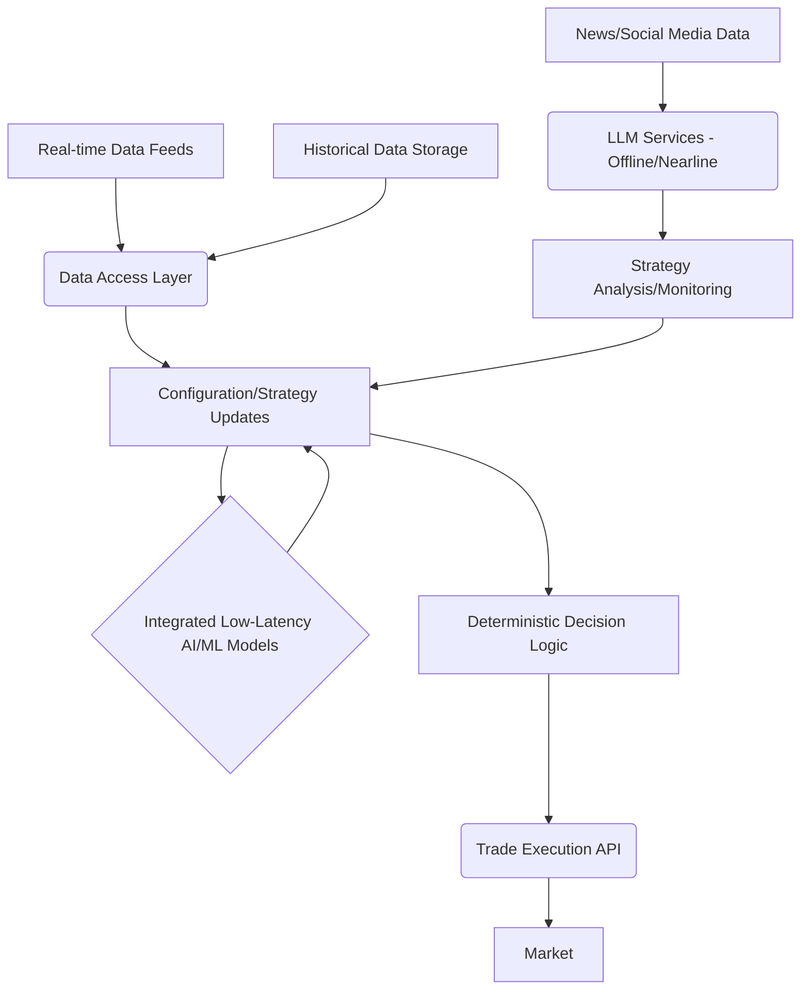

# Optimal Architectural Plan for a Streamlined, Accurate, and Low-Latency Trading System

## Overview

This document outlines an optimal architectural plan for the NextG3N trading system, prioritizing streamlining, accuracy, and low latency in the critical path of trading decisions and execution. This plan moves away from a heavily distributed agent-based orchestration for the core trading loop and focuses on consolidating high-performance components.

## Core Principles

*   **Minimize Latency:** Reduce communication overhead and processing time at every step of the trading decision pipeline.
*   **Prioritize Performance:** Utilize high-performance languages, frameworks, and data access methods for the critical trading path.
*   **Ensure Accuracy and Repeatability:** Implement deterministic decision logic and utilize optimized, reliable AI/ML models.
*   **Leverage LLMs Strategically:** Employ LLMs for tasks where their capabilities are valuable but do not introduce unacceptable latency in the core trading loop.

## Architectural Components and Flow

## Detailed Plan

1.  **High-Performance Trading Engine (Core Component):**
    *   **Design:** Create a single, cohesive application responsible for the entire critical trading path.
    *   **Implementation:** Choose a high-performance language (e.g., Python with libraries like `asyncio`, `numpy`, `pandas`, optimized C++ modules, or Rust) and frameworks suitable for low-latency processing.
    *   **Responsibilities:** Real-time data consumption, integrated model inference, deterministic decision making, and direct interaction with trade execution APIs.

2.  **Integrated, Low-Latency AI/ML Models:**
    *   **Selection/Development:** Identify or develop AI/ML models specifically optimized for fast inference (e.g., shallow neural networks, optimized tree-based models, or highly tuned transformer variants). Models for sentiment, short-term price forecasting, and relevant pattern recognition should be considered.
    *   **Integration:** Integrate these models directly into the High-Performance Trading Engine process to eliminate inter-process communication overhead. Utilize efficient libraries for model loading and inference (e.g., ONNX Runtime, TensorFlow Lite, or optimized PyTorch inference).

3.  **Direct and Efficient Data Access Layer:**
    *   **Real-time Data:** Implement direct connections to low-latency market data feeds (e.g., using WebSocket APIs or specialized data protocols).
    *   **Historical Data:** Utilize in-memory databases (e.g., Redis, Memcached) or highly optimized time-series databases for storing and retrieving historical data required by the models with minimal latency.
    *   **Processing:** Implement efficient data parsing, transformation, and feature engineering within this layer or the trading engine.

4.  **Deterministic and Optimized Decision Logic:**
    *   **Implementation:** Develop the trading decision logic using clear, deterministic rules and algorithms based on the processed data and integrated model outputs.
    *   **Avoid LLM in Critical Path:** Do not use general-purpose LLMs for the final buy/sell/hold decision in the low-latency path due to their latency and non-deterministic nature.
    *   **Repeatability:** Ensure the decision logic is fully repeatable for effective backtesting and consistent live trading.

5.  **LLMs for Offline and Nearline Tasks:**
    *   **Role:** Utilize LLMs for tasks that are not time-critical, such as:
        *   In-depth analysis of unstructured data (news, social media) for broader market themes or long-term sentiment signals.
        *   Generating insights and reports on trading performance.
        *   Assisting in the development and refinement of trading strategies (e.g., suggesting new rules or parameters).
        *   Monitoring system logs and health metrics for anomalies.
    *   **Integration:** These LLM services can run as separate components or microservices, potentially using the MCP framework or other suitable communication methods, as their latency does not impact the core trading loop.

6.  **Efficient Trade Execution Integration:**
    *   **Communication:** Use asynchronous and efficient communication protocols (e.g., gRPC, optimized REST APIs) to interact with trade execution platforms.
    *   **Error Handling:** Implement robust error handling and retry mechanisms for trade orders.

7.  **Streamlined Workflow:**
    *   Design the core trading process as a lean, sequential pipeline: Data Ingestion -> Data Processing/Feature Engineering -> Integrated Model Inference -> Deterministic Decision Logic -> Trade Execution.
    *   Minimize complex inter-component communication and coordination within this critical path.

8.  **Evaluation and Iteration:**
    *   Implement comprehensive monitoring and logging to track latency at each stage of the pipeline, model inference times, decision accuracy, and trading profitability.
    *   Continuously analyze performance data and iterate on the models, data access methods, decision logic, and overall architecture to identify and implement optimizations.

## Conclusion

This optimal architectural plan focuses on building a high-performance, low-latency trading engine with tightly integrated AI/ML models and deterministic decision logic for the critical trading path. LLMs are strategically utilized for supporting, less latency-sensitive tasks. This approach aims to achieve the desired levels of streamlining, accuracy, repeatability, and ultimately, profitability in a demanding trading environment.