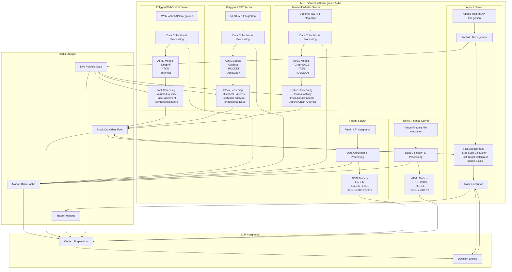
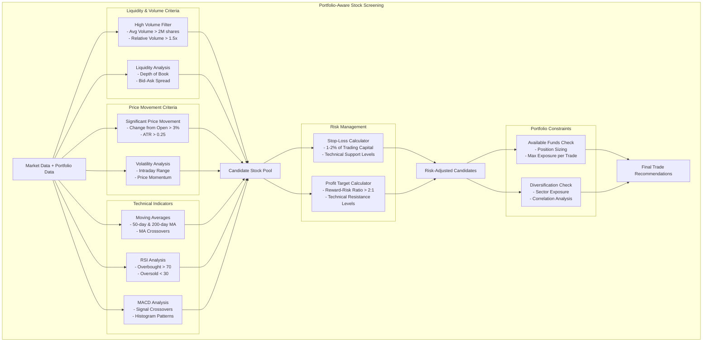

# NextG3N Trading System Enhancement Plan

This document outlines the comprehensive implementation plan for enhancing the NextG3N Trading System with advanced AI/ML models while maintaining the existing architecture.

## System Architecture



## Implementation Details

### 1. Portfolio-Aware Stock Screening

The stock screening components will implement these specific criteria:



### 2. Redis Data Structure

#### Stock Candidate Pool

```
# Key: stock_pool:{date}:{source}
# Value: JSON array of stock candidates with screening metrics

# Example for Polygon WebSocket candidates
{
    "timestamp": "2025-05-07T17:30:00Z",
    "source": "polygon_websocket",
    "candidates": [
        {
            "symbol": "AAPL",
            "last_price": 198.45,
            "volume": 5234567,
            "rel_volume": 1.8,
            "price_change_pct": 0.042,  # 4.2% change from open
            "atr": 3.25,
            "rsi": 68,
            "macd": 1.2,
            "ma_50_200_cross": true,
            "screening_score": 0.85
        },
        # More candidates...
    ]
}

# Key: stock_pool:{date}:risk_assessed
# Value: JSON array of risk-assessed candidates

{
    "timestamp": "2025-05-07T17:35:00Z",
    "candidates": [
        {
            "symbol": "AAPL",
            "last_price": 198.45,
            "volume": 5234567,
            "rel_volume": 1.8,
            "price_change_pct": 0.042,
            "atr": 3.25,
            "rsi": 68,
            "screening_score": 0.85,
            
            # Risk assessment fields
            "stop_price": 193.75,
            "profit_target": 207.85,
            "position_size": 100,
            "max_shares": 50,
            "estimated_cost": 9922.50,
            "risk_amount": 235.00,
            "reward_risk_ratio": 2.5,
            "portfolio_fit_score": 0.78,
            "risk_score": 0.82
        },
        # More candidates...
    ]
}
```

#### Trade Positions

```
# Key: trade_positions:active
# Value: JSON array of active trade positions

{
    "timestamp": "2025-05-07T17:40:00Z",
    "positions": [
        {
            "symbol": "AAPL",
            "entry_price": 198.45,
            "current_price": 199.20,
            "quantity": 50,
            "stop_price": 193.75,
            "profit_target": 207.85,
            "entry_time": "2025-05-07T15:30:00Z",
            "unrealized_pnl": 37.50,
            "unrealized_pnl_pct": 0.0038
        },
        # More positions...
    ]
}

# Key: trade_positions:history:{date}
# Value: JSON array of closed trade positions

{
    "timestamp": "2025-05-07T17:40:00Z",
    "positions": [
        {
            "symbol": "MSFT",
            "entry_price": 402.30,
            "exit_price": 408.75,
            "quantity": 25,
            "stop_price": 395.00,
            "profit_target": 415.00,
            "entry_time": "2025-05-06T14:15:00Z",
            "exit_time": "2025-05-07T10:30:00Z",
            "realized_pnl": 161.25,
            "realized_pnl_pct": 0.016,
            "exit_reason": "profit_target"
        },
        # More positions...
    ]
}
```

#### Portfolio Data

```
# Key: portfolio:current
# Value: JSON object with portfolio details

{
    "timestamp": "2025-05-07T17:45:00Z",
    "account_value": 105234.56,
    "cash_balance": 42567.89,
    "available_funds": 38750.45,
    "margin_used": 3817.44,
    "day_pnl": 1234.56,
    "day_pnl_pct": 0.0118,
    "positions_count": 8,
    "sector_allocation": {
        "technology": 0.45,
        "healthcare": 0.25,
        "consumer_discretionary": 0.15,
        "financials": 0.10,
        "energy": 0.05
    },
    "risk_metrics": {
        "portfolio_beta": 1.15,
        "sharpe_ratio": 1.8,
        "max_drawdown": 0.05,
        "var_95": 0.02
    }
}
```

## MCP Server Enhancements

### 1. Polygon WebSocket Server

The Polygon WebSocket Server will be enhanced with:

1. **Pre-trained AI/ML Models**:
   - DeepAR for time series forecasting
   - TCN for anomaly detection
   - Informer for order book dynamics

2. **Portfolio-Aware Stock Screening**:
   - High volume filter (>2M shares, >1.5x relative volume)
   - Significant price movement (>3% change from open)
   - Technical indicator analysis (RSI, MACD, Moving Averages)
   - Real-time pattern detection

3. **Implementation Details**:
   - All AI/ML models will be integrated directly in the server
   - Models will process real-time WebSocket data
   - Screened candidates will be stored in Redis stock pool
   - Portfolio data will be used to filter candidates based on available funds

### 2. Polygon REST Server

The Polygon REST Server will be enhanced with:

1. **Pre-trained AI/ML Models**:
   - CatBoost for technical indicator pattern recognition
   - ROCKET for time series classification
   - AutoGluon for mixed feature processing

2. **Historical Pattern Analysis**:
   - Multi-timeframe pattern detection
   - Support/resistance level identification
   - Trend strength analysis
   - Fundamental data integration

3. **Implementation Details**:
   - All AI/ML models will be integrated directly in the server
   - Models will process historical market data
   - Pattern analysis will be stored in Redis for LLM context
   - Portfolio constraints will be applied to recommendations

### 3. Unusual Whales Server

The Unusual Whales Server will be enhanced with:

1. **Pre-trained AI/ML Models**:
   - GraphSAGE for options chain relationship modeling
   - TGN for temporal dynamics in options data
   - HDBSCAN for institutional activity clustering

2. **Options Flow Analysis**:
   - Unusual activity detection
   - Institutional pattern recognition
   - Options chain visualization
   - Sentiment extraction from options positioning

3. **Implementation Details**:
   - All AI/ML models will be integrated directly in the server
   - Models will process options flow data
   - Unusual activity alerts will be stored in Redis
   - Portfolio risk exposure will be considered for options recommendations

### 4. Reddit Server

The Reddit Server will be enhanced with:

1. **Pre-trained AI/ML Models**:
   - FinBERT-tone for financial sentiment analysis
   - RoBERTa-SEC for financial language understanding
   - FinancialBERT-NER for named entity recognition

2. **Sentiment Analysis**:
   - Ticker-specific sentiment extraction
   - Entity-sentiment linking
   - Trend analysis over time
   - Retail sentiment classification

3. **Implementation Details**:
   - All AI/ML models will be integrated directly in the server
   - Models will process social media data
   - Sentiment analysis will be fed directly to the LLM
   - Entity recognition will link sentiment to specific stocks

### 5. Yahoo Finance Server

The Yahoo Finance Server will be enhanced with:

1. **Pre-trained AI/ML Models**:
   - PEGASUS for news summarization
   - REBEL for event extraction
   - FinancialBERT for analyst rating classification

2. **News Analysis**:
   - Event impact prediction
   - Analyst consensus analysis
   - News relevance scoring
   - Market-moving event detection

3. **Implementation Details**:
   - All AI/ML models will be integrated directly in the server
   - Models will process news and market data
   - News analysis will be fed directly to the LLM
   - Event extraction will identify potential catalysts

### 6. Alpaca Server

The Alpaca Server will be enhanced with:

1. **Portfolio Management**:
   - Real-time portfolio tracking
   - Available funds monitoring
   - Position sizing calculation
   - Sector exposure analysis

2. **Risk Assessment**:
   - Stop-loss calculation based on ATR and fixed percentage
   - Profit target calculation based on reward-risk ratio
   - Position sizing based on max risk per trade
   - Portfolio diversification checks

3. **Trade Execution**:
   - Order type optimization
   - Slippage control
   - Execution timing
   - Order splitting for large positions

4. **Implementation Details**:
   - Risk assessment will be applied to stock candidates in Redis
   - Trade positions will be stored in Redis for tracking
   - Portfolio data will be used by screening components
   - Execution feedback will be provided to the LLM

## LLM Integration

The LLM will be enhanced to:

1. **Context Preparation**:
   - Integrate market data from all sources
   - Include risk-assessed stock candidates
   - Incorporate portfolio constraints
   - Add sentiment and news context

2. **Decision Engine**:
   - Make final buy/sell/hold decisions
   - Determine optimal entry/exit points
   - Adjust position sizing based on confidence
   - Provide reasoning for decisions

3. **Implementation Details**:
   - LLM will receive data from Redis and MCP servers
   - Specialized prompt template will be used for trading decisions
   - Confidence thresholds will be applied for execution
   - Feedback loop will improve future decisions

## Implementation Timeline

1. **Phase 1: Infrastructure Setup (Weeks 1-2)**
   - Set up Redis schema for stock pool, trades, and portfolio
   - Prepare model deployment infrastructure
   - Create testing environment

2. **Phase 2: Model Integration (Weeks 3-6)**
   - Integrate pre-trained models into MCP servers
   - Implement stock screening components
   - Set up data flows to/from Redis

3. **Phase 3: Risk Assessment (Weeks 7-8)**
   - Implement portfolio-aware risk assessment
   - Create position sizing algorithms
   - Set up stop-loss and profit target calculations

4. **Phase 4: LLM Integration (Weeks 9-10)**
   - Enhance LLM prompt templates
   - Implement context preparation
   - Create decision engine logic

5. **Phase 5: Testing and Optimization (Weeks 11-12)**
   - Backtest with historical data
   - Optimize parameters
   - Perform paper trading tests

## Conclusion

This implementation plan enhances the NextG3N Trading System with advanced AI/ML models while maintaining the existing architecture. By integrating pre-trained models directly into the MCP servers and using Redis for data storage and communication, we create a powerful system that can:

1. Screen stocks based on proven day trading criteria
2. Apply portfolio-aware risk management
3. Leverage sentiment and news analysis
4. Make informed trading decisions through the LLM

The system maintains low latency by keeping all AI/ML processing within the MCP servers and using Redis for efficient data storage and retrieval.